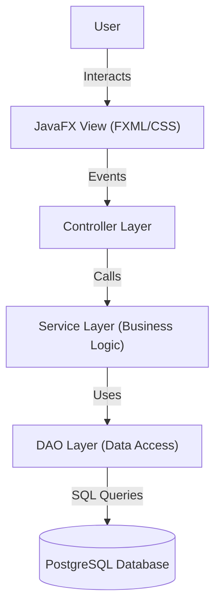

# Student Performance Analysis System

A comprehensive JavaFX-based desktop application designed to manage student records, track academic performance, and generate insightful analysis reports.

## 🚀 Features

### 🎓 Student Management
- **Add/Edit Students**: Register new students with details like name, email, phone, and enrollment date.
- **View Students**: List all students with search and filter capabilities.
- **Delete Students**: Remove student records from the system.

### 📚 Subject Management
- **Course Catalog**: Manage subjects with codes, names, and credit values.
- **Add Subjects**: Define new subjects for the curriculum.

### 📝 Marks Management
- **Grade Entry**: Record marks for students across different subjects.
- **Performance Tracking**: View history of student performance.

### 📊 Analysis & Reports
- **Performance Dashboard**: Visual charts analyzing student performance trends.
- **Detailed Reports**: Generate comprehensive reports on student grades and subject averages.

## 🏗️ Architecture

The application follows a modular **Model-View-Controller (MVC)** architecture with a layered design pattern:



- **Presentation Layer**: JavaFX (FXML) for UI, CSS for styling.
- **Controller Layer**: Handles user inputs and updates the view.
- **Service Layer**: Contains business logic and validations.
- **DAO Layer**: Manages database operations using JDBC.
- **Database**: PostgreSQL for persistent storage.

## 🛠️ Tech Stack

- **Language**: Java 25 (OpenJDK 25.0.2)
- **UI Framework**: JavaFX 17.0.2
- **Database**: PostgreSQL 16+ (Driver: 42.7.9)
- **Build System**: Manual / Shell Scripts (No Maven/Gradle)

## 📂 Project Structure

```
Student-Performance-Analysis-System/
├── src/
│   └── main/
│       ├── java/com/studentanalysis/
│       │   ├── controller/   # UI Logic (MainController, StudentListController...)
│       │   ├── model/        # Data Models (Student, Subject, Marks...)
│       │   ├── service/      # Business Logic (StudentService, AnalysisService...)
│       │   ├── dao/          # Database Access (StudentDAO, MarksDAO...)
│       │   └── util/         # Utilities (DBConnection)
│       └── resources/
│           ├── fxml/         # UI Layouts (.fxml files)
│           └── css/          # Stylesheets (.css files)
├── lib/                      # External libraries
├── database/
│   └── schema.sql            # Database creation script
├── docs/                     # Documentation
├── javafx/                   # JavaFX SDK
└── postgresql-42.7.9.jar     # JDBC Driver
```

## 🏃 Getting Started

For detailed step-by-step instructions on how to compile and run the application, please refer to the **[Run Guide](RUN_GUIDE.md)**.

### Quick Setup
1. **Database**: Ensure PostgreSQL is running and create a database named `student_performance_db`.
2. **Schema**: Run `database/schema.sql` to set up tables.
3. **Run**: Use the provided scripts in the `RUN_GUIDE.md` to compile and launch.

## 🤝 Contributing
Contributions are welcome! Please fork the repository and submit a pull request.